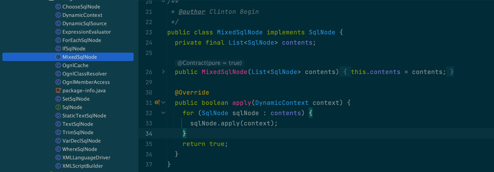

# MYBATIS_SOURCE

##  执行流程
**SqlSessionFactory -> SqlSession(execute) -> execute Sql -> return result**

### 1.从 XML 中构建 SqlSessionFactory(Configuration)
解析所有classpath地下的所有xml为Configuration，包装为DefaultSqlSessionFactory。

```java
Reader reader = Resources.getResourceAsReader("Configuration.xml");
SqlSessionFactory sqlMapper = new SqlSessionFactoryBuilder().build(reader);
```

SqlSessionFactoryBuilder -> build (47)

 ```java
 public class SqlSessionFactoryBuilder {

    public SqlSessionFactory build(Reader reader) {
        return build(reader, null, null);
    }

    public SqlSessionFactory build(Reader reader, String environment, Properties properties) {
        try {
            // 初始化xml配置解析器，并初始化configuration（初始化typeHandlerRegistry和typeAliasRegistry）
            XMLConfigBuilder parser = new XMLConfigBuilder(reader, environment, properties);
            // 解析xml配置
            return build(parser.parse());
        } catch (Exception e) {
            throw ExceptionFactory.wrapException("Error building SqlSession.", e);
        } finally {
            ErrorContext.instance().reset();
            try {
                reader.close();
            } catch (IOException e) {
                // Intentionally ignore. Prefer previous error.
            }
        }
    }
}
 ```

XMLConfigBuilder -> parser.parse() (94) xml配置具体解析

```java

public class XMLConfigBuilder extends BaseBuilder {

    public Configuration parse() {
        if (parsed) {
            throw new BuilderException("Each XMLConfigBuilder can only be used once.");
        }
        parsed = true;
        // configuration 的解析
        parseConfiguration(parser.evalNode("/configuration"));
        return configuration;
    }

    private void parseConfiguration(XNode root) {
        try {
            //issue #117 read properties first
            propertiesElement(root.evalNode("properties"));
            Properties settings = settingsAsProperties(root.evalNode("settings"));
            loadCustomVfs(settings);
            loadCustomLogImpl(settings);
            typeAliasesElement(root.evalNode("typeAliases"));
            pluginElement(root.evalNode("plugins"));
            objectFactoryElement(root.evalNode("objectFactory"));
            objectWrapperFactoryElement(root.evalNode("objectWrapperFactory"));
            reflectorFactoryElement(root.evalNode("reflectorFactory"));
            settingsElement(settings);
            // read it after objectFactory and objectWrapperFactory issue #631
            environmentsElement(root.evalNode("environments"));
            databaseIdProviderElement(root.evalNode("databaseIdProvider"));
            typeHandlerElement(root.evalNode("typeHandlers"));
            // 具体mapper的解析
            mapperElement(root.evalNode("mappers"));
        } catch (Exception e) {
            throw new BuilderException("Error parsing SQL Mapper Configuration. Cause: " + e, e);
        }
    }
}
```

XMLMapperBuilder -> parse (92)  每个mapper的解析

```java
public class XMLMapperBuilder extends BaseBuilder {

    private final XPathParser parser;
    private final MapperBuilderAssistant builderAssistant;
    private final Map<String, XNode> sqlFragments;
    private final String resource;


    public void parse() {
        if (!configuration.isResourceLoaded(resource)) {
            // mapper（xml） -> MappedStatement
            configurationElement(parser.evalNode("/mapper"));
            configuration.addLoadedResource(resource);
            bindMapperForNamespace();
        }

        parsePendingResultMaps();
        parsePendingCacheRefs();
        parsePendingStatements();
    }
    
    private void configurationElement(XNode context) {
        try {
            String namespace = context.getStringAttribute("namespace");
            if (namespace == null || namespace.equals("")) {
                throw new BuilderException("Mapper's namespace cannot be empty");
            }
            builderAssistant.setCurrentNamespace(namespace);
            // 缓存解析 - 二级缓存
            cacheRefElement(context.evalNode("cache-ref"));
            cacheElement(context.evalNode("cache"));
            parameterMapElement(context.evalNodes("/mapper/parameterMap"));
            resultMapElements(context.evalNodes("/mapper/resultMap"));
            sqlElement(context.evalNodes("/mapper/sql"));
            // 解析sql
            buildStatementFromContext(context.evalNodes("select|insert|update|delete"));
        } catch (Exception e) {
            throw new BuilderException("Error parsing Mapper XML. The XML location is '" + resource + "'. Cause: " + e, e);
        }
    }
}
```

###  2. SqlSessionFactory -> SqlSession(execute)

准备执行器execute ==>DefaultSqlSession

```java
SqlSession session = sqlMapper.openSession()
```

DefaultSqlSessionFactory -> openSession (46) 

```java
public class DefaultSqlSessionFactory implements SqlSessionFactory {

    private final Configuration configuration;

    public DefaultSqlSessionFactory(Configuration configuration) {
        this.configuration = configuration;
    }

    @Override
    public SqlSession openSession() {
        return openSessionFromDataSource(configuration.getDefaultExecutorType(), null, false);
    }
    
    private SqlSession openSessionFromDataSource(ExecutorType execType, TransactionIsolationLevel level, boolean autoCommit) {
        Transaction tx = null;
        try {
            final Environment environment = configuration.getEnvironment();
            final TransactionFactory transactionFactory = getTransactionFactoryFromEnvironment(environment);
            tx = transactionFactory.newTransaction(environment.getDataSource(), level, autoCommit);
            // 初始化执行器
            final Executor executor = configuration.newExecutor(tx, execType);
            return new DefaultSqlSession(configuration, executor, autoCommit);
        } catch (Exception e) {
            closeTransaction(tx); // may have fetched a connection so lets call close()
            throw ExceptionFactory.wrapException("Error opening session.  Cause: " + e, e);
        } finally {
            ErrorContext.instance().reset();
        }
    }
    
}
```

Configuration -> newExecutor （572）

```java

public class Configuration {
    public Executor newExecutor(Transaction transaction, ExecutorType executorType) {
        executorType = executorType == null ? defaultExecutorType : executorType;
        executorType = executorType == null ? ExecutorType.SIMPLE : executorType;
        Executor executor;

        if (ExecutorType.BATCH == executorType) {
            executor = new BatchExecutor(this, transaction);
        } else if (ExecutorType.REUSE == executorType) {
            executor = new ReuseExecutor(this, transaction);
        } else {
            executor = new SimpleExecutor(this, transaction);
        }
        // 若开启缓存（二级）则会装饰为CachingExecutor
        if (cacheEnabled) {
            executor = new CachingExecutor(executor);
        }
        executor = (Executor) interceptorChain.pluginAll(executor);
        return executor;
    }
}
```

### 3.执行sql

```java
User user = session.selectOne("org.github.baker.internal.inter.UserMapper.selectById", 1L)
```

DefaultSqlSession -> selectList (145)

```java

public class DefaultSqlSession implements SqlSession {

    private final Configuration configuration;
    private final Executor executor;
    
    public <E> List<E> selectList(String statement, Object parameter, RowBounds rowBounds) {
        try {
            // 根据statement从配置中查找已解析的数据
            MappedStatement ms = configuration.getMappedStatement(statement);
            // 委托给execute执行
            return executor.query(ms, wrapCollection(parameter), rowBounds, Executor.NO_RESULT_HANDLER);
        } catch (Exception e) {
            throw ExceptionFactory.wrapException("Error querying database.  Cause: " + e, e);
        } finally {
            ErrorContext.instance().reset();
        }
    }
}
```

BaseExecute -> query (94)

```java
public abstract class BaseExecutor implements Executor {
    @Override
    public <E> List<E> query(MappedStatement ms, Object parameter, RowBounds rowBounds, ResultHandler resultHandler, CacheKey key, BoundSql boundSql) throws SQLException {
        ErrorContext.instance().resource(ms.getResource()).activity("executing a query").object(ms.getId());
        if (closed) {
            throw new ExecutorException("Executor was closed.");
        }
        if (queryStack == 0 && ms.isFlushCacheRequired()) {
            clearLocalCache();
        }
        List<E> list;
        try {
            queryStack++;
            // 查询一级缓存
            list = resultHandler == null ? (List<E>) localCache.getObject(key) : null;
            if (list != null) {
                handleLocallyCachedOutputParameters(ms, key, parameter, boundSql);
            } else {
                list = queryFromDatabase(ms, parameter, rowBounds, resultHandler, key, boundSql);
            }
        } finally {
            queryStack--;
        }
        if (queryStack == 0) {
            for (DeferredLoad deferredLoad : deferredLoads) {
                deferredLoad.load();
            }
            // issue #601
            deferredLoads.clear();
            if (configuration.getLocalCacheScope() == LocalCacheScope.STATEMENT) {
                // issue #482
                clearLocalCache();
            }
        }
        return list;
    }
}
```


## 缓存
在 myBatsi中有一级缓存和二级缓存区分
1. 一级缓存作用域为session，由session统一管理，默认开启
2. 二级缓存作用域为mapper，每一个Mapper分配一个Cache缓存对象，并对需要做缓存的statement作配置（useCache="true），即可生效

### 一级缓存实现

```java
public abstract class BaseExecutor implements Executor {

    // 存储一级缓存
    protected PerpetualCache localCache;
    protected PerpetualCache localOutputParameterCache;
    protected Configuration configuration;

    protected int queryStack;
    private boolean closed;

    protected BaseExecutor(Configuration configuration, Transaction transaction) {
        this.transaction = transaction;
        this.deferredLoads = new ConcurrentLinkedQueue<>();
        // 初始化localCache
        this.localCache = new PerpetualCache("LocalCache");
        this.localOutputParameterCache = new PerpetualCache("LocalOutputParameterCache");
        this.closed = false;
        this.configuration = configuration;
        this.wrapper = this;
    }
    
    @Override
    public <E> List<E> query(MappedStatement ms, Object parameter, RowBounds rowBounds, ResultHandler resultHandler, CacheKey key, BoundSql boundSql) throws SQLException {
        ErrorContext.instance().resource(ms.getResource()).activity("executing a query").object(ms.getId());
        if (closed) {
            throw new ExecutorException("Executor was closed.");
        }
        if (queryStack == 0 && ms.isFlushCacheRequired()) {
            clearLocalCache();
        }
        List<E> list;
        try {
            queryStack++;
            // 查询一级缓存，
            list = resultHandler == null ? (List<E>) localCache.getObject(key) : null;
            if (list != null) {
                handleLocallyCachedOutputParameters(ms, key, parameter, boundSql);
            } else {
                list = queryFromDatabase(ms, parameter, rowBounds, resultHandler, key, boundSql);
            }
        } finally {
            queryStack--;
        }
        if (queryStack == 0) {
            for (DeferredLoad deferredLoad : deferredLoads) {
                deferredLoad.load();
            }
            // issue #601
            deferredLoads.clear();
            if (configuration.getLocalCacheScope() == LocalCacheScope.STATEMENT) {
                // issue #482
                clearLocalCache();
            }
        }
        return list;
    }

    private <E> List<E> queryFromDatabase(MappedStatement ms, Object parameter, RowBounds rowBounds, ResultHandler resultHandler, CacheKey key, BoundSql boundSql) throws SQLException {
        List<E> list;
        localCache.putObject(key, EXECUTION_PLACEHOLDER);
        try {
            list = doQuery(ms, parameter, rowBounds, resultHandler, boundSql);
        } finally {
            localCache.removeObject(key);
        }
        // 添加缓存
        localCache.putObject(key, list);
        if (ms.getStatementType() == StatementType.CALLABLE) {
            localOutputParameterCache.putObject(key, parameter);
        }
        return list;
    }
    
    // 处理本地缓存输出数据
    private void handleLocallyCachedOutputParameters(MappedStatement ms, CacheKey key, Object parameter, BoundSql boundSql) {
        if (ms.getStatementType() == StatementType.CALLABLE) {
            final Object cachedParameter = localOutputParameterCache.getObject(key);
            if (cachedParameter != null && parameter != null) {
                final MetaObject metaCachedParameter = configuration.newMetaObject(cachedParameter);
                final MetaObject metaParameter = configuration.newMetaObject(parameter);
                for (ParameterMapping parameterMapping : boundSql.getParameterMappings()) {
                    if (parameterMapping.getMode() != ParameterMode.IN) {
                        final String parameterName = parameterMapping.getProperty();
                        final Object cachedValue = metaCachedParameter.getValue(parameterName);
                        metaParameter.setValue(parameterName, cachedValue);
                    }
                }
            }
        }
    }

    // 在update或者commit时清缓存
    @Override
    public int update(MappedStatement ms, Object parameter) throws SQLException {
        ErrorContext.instance().resource(ms.getResource()).activity("executing an update").object(ms.getId());
        if (closed) {
            throw new ExecutorException("Executor was closed.");
        }
        clearLocalCache();
        return doUpdate(ms, parameter);
    }

    @Override
    public void commit(boolean required) throws SQLException {
        if (closed) {
            throw new ExecutorException("Cannot commit, transaction is already closed");
        }
        clearLocalCache();
        flushStatements();
        if (required) {
            transaction.commit();
        }
    }
    
}
```

### 二级缓存实现

```java
public class CachingExecutor implements Executor {

    private final Executor delegate;
    private final TransactionalCacheManager tcm = new TransactionalCacheManager();

    // #94
    @Override
    public <E> List<E> query(MappedStatement ms, Object parameterObject, RowBounds rowBounds, ResultHandler resultHandler, CacheKey key, BoundSql boundSql)
            throws SQLException {
        // 若有配置二级缓存配置（<cache/>）则在parse时会初始化Cache
        Cache cache = ms.getCache();
        if (cache != null) {
            flushCacheIfRequired(ms);
            if (ms.isUseCache() && resultHandler == null) {
                ensureNoOutParams(ms, boundSql);
                @SuppressWarnings("unchecked")
                // 查询缓存 ，或查询到则返回，若没查到则走baseExecute的query。  
                List<E> list = (List<E>) tcm.getObject(cache, key);
                if (list == null) {
                    list = delegate.query(ms, parameterObject, rowBounds, resultHandler, key, boundSql);
                    // 添加缓存
                    tcm.putObject(cache, key, list); // issue #578 and #116
                }
                return list;
            }
        }
        return delegate.query(ms, parameterObject, rowBounds, resultHandler, key, boundSql);
    }
}
```

#### 如何添加缓存（tcm.putObject(cache, key, list)），什么时候

缓存由TransactionalCacheManager管理,TransactionalCache的putObject只是将数据保存在entriesToAddOnCommit中，而等此session执行完之后commit时统一flash到Cache中

```java
public class TransactionalCacheManager {

  private final Map<Cache, TransactionalCache> transactionalCaches = new HashMap<>();

  public void clear(Cache cache) {
    getTransactionalCache(cache).clear();
  }
  
  public Object getObject(Cache cache, CacheKey key) {
    return getTransactionalCache(cache).getObject(key);
  }
  
  public void putObject(Cache cache, CacheKey key, Object value) {
    getTransactionalCache(cache).putObject(key, value);
  }

  public void commit() {
    for (TransactionalCache txCache : transactionalCaches.values()) {
      txCache.commit();
    }
  }

  public void rollback() {
    for (TransactionalCache txCache : transactionalCaches.values()) {
      txCache.rollback();
    }
  }

  private TransactionalCache getTransactionalCache(Cache cache) {
    return transactionalCaches.computeIfAbsent(cache, TransactionalCache::new);
  }
}
```

```java
public class TransactionalCache implements Cache {

    private static final Log log = LogFactory.getLog(TransactionalCache.class);

    private final Cache delegate;
    private boolean clearOnCommit;
    private final Map<Object, Object> entriesToAddOnCommit;
    private final Set<Object> entriesMissedInCache;

    public TransactionalCache(Cache delegate) {
        this.delegate = delegate;
        this.clearOnCommit = false;
        this.entriesToAddOnCommit = new HashMap<>();
        this.entriesMissedInCache = new HashSet<>();
    }
    
    @Override
    public Object getObject(Object key) {
        // issue #116
        Object object = delegate.getObject(key);
        if (object == null) {
            entriesMissedInCache.add(key);
        }
        // issue #146
        if (clearOnCommit) {
            return null;
        } else {
            return object;
        }
    }


    // putObject只是将数据保存在entriesToAddOnCommit中
    @Override
    public void putObject(Object key, Object object) {
        entriesToAddOnCommit.put(key, object);
    }

    
    @Override
    public void clear() {
        clearOnCommit = true;
        entriesToAddOnCommit.clear();
    }

    public void commit() {
        if (clearOnCommit) {
            delegate.clear();
        }
        // 添加数据
        flushPendingEntries();
        reset();
    }

    public void rollback() {
        unlockMissedEntries();
        reset();
    }

    // 
    private void flushPendingEntries() {
        for (Map.Entry<Object, Object> entry : entriesToAddOnCommit.entrySet()) {
            delegate.putObject(entry.getKey(), entry.getValue());
        }
        for (Object entry : entriesMissedInCache) {
            if (!entriesToAddOnCommit.containsKey(entry)) {
                delegate.putObject(entry, null);
            }
        }
    }
    
}
```

## 设计模式应用

### 装饰器模式 

CachingExecutor的使用

```java

public class Configuration {
    public Executor newExecutor(Transaction transaction, ExecutorType executorType) {
        
        Executor executor = new SimpleExecutor(this, transaction);
        // 若开启缓存，则装饰为缓存执行器
        if (cacheEnabled) {
            executor = new CachingExecutor(executor);
        }
        executor = (Executor) interceptorChain.pluginAll(executor);
        return executor;
    }
}
```
与SimpleExecutor实现相同的接口*Executor*且在其实现中进行增强
```java
public class CachingExecutor implements Executor {
    private final Executor delegate;

    @Override
    public <E> List<E> query(MappedStatement ms, Object parameterObject, RowBounds rowBounds, ResultHandler resultHandler, CacheKey key, BoundSql boundSql)
            throws SQLException {
        // -------------enhance-----------------
        Cache cache = ms.getCache();
        if (cache != null) {
            flushCacheIfRequired(ms);
            if (ms.isUseCache() && resultHandler == null) {
                ensureNoOutParams(ms, boundSql);
                @SuppressWarnings("unchecked")
                List<E> list = (List<E>) tcm.getObject(cache, key);
                if (list == null) {
                    list = delegate.query(ms, parameterObject, rowBounds, resultHandler, key, boundSql);
                    tcm.putObject(cache, key, list); // issue #578 and #116
                }
                return list;
            }
        }
        // -------------enhance-----------------
        // 调用SimpleExecutor
        return delegate.query(ms, parameterObject, rowBounds, resultHandler, key, boundSql);
    }
}
```

### 建造者模式

SqlSessionFactoryBuilder

```java
public class SqlSessionFactoryBuilder {

  public SqlSessionFactory build(Reader reader) {
    return build(reader, null, null);
  }

  public SqlSessionFactory build(Reader reader, String environment) {
    return build(reader, environment, null);
  }

  public SqlSessionFactory build(Reader reader, Properties properties) {
    return build(reader, null, properties);
  }

  //  一步步的建造SqlSessionFactory
  public SqlSessionFactory build(Reader reader, String environment, Properties properties) {
    try {
      // 初始化xml配置解析器，并初始化configuration（初始化typeHandlerRegistry和typeAliasRegistry）
      XMLConfigBuilder parser = new XMLConfigBuilder(reader, environment, properties);
      // 解析xml配置
      return build(parser.parse());
    } catch (Exception e) {
      throw ExceptionFactory.wrapException("Error building SqlSession.", e);
    } finally {
      ErrorContext.instance().reset();
      try {
        reader.close();
      } catch (IOException e) {
        // Intentionally ignore. Prefer previous error.
      }
    }
  }

  public SqlSessionFactory build(InputStream inputStream) {
    return build(inputStream, null, null);
  }

  public SqlSessionFactory build(InputStream inputStream, String environment) {
    return build(inputStream, environment, null);
  }

  public SqlSessionFactory build(InputStream inputStream, Properties properties) {
    return build(inputStream, null, properties);
  }

  public SqlSessionFactory build(InputStream inputStream, String environment, Properties properties) {
    try {
      XMLConfigBuilder parser = new XMLConfigBuilder(inputStream, environment, properties);
      return build(parser.parse());
    } catch (Exception e) {
      throw ExceptionFactory.wrapException("Error building SqlSession.", e);
    } finally {
      ErrorContext.instance().reset();
      try {
        inputStream.close();
      } catch (IOException e) {
        // Intentionally ignore. Prefer previous error.
      }
    }
  }

  public SqlSessionFactory build(Configuration config) {
    return new DefaultSqlSessionFactory(config);
  }
}
```

### 工厂模式

SqlSessionFactory

```java
public interface SqlSessionFactory {
    SqlSession openSession();
}

public class DefaultSqlSessionFactory implements SqlSessionFactory {

    private final Configuration configuration;

    public DefaultSqlSessionFactory(Configuration configuration) {
        this.configuration = configuration;
    }

    @Override
    public SqlSession openSession() {
        return openSessionFromDataSource(configuration.getDefaultExecutorType(), null, false);
    }
    
    private SqlSession openSessionFromDataSource(ExecutorType execType, TransactionIsolationLevel level, boolean autoCommit) {
        Transaction tx = null;
        try {
            final Environment environment = configuration.getEnvironment();
            final TransactionFactory transactionFactory = getTransactionFactoryFromEnvironment(environment);
            tx = transactionFactory.newTransaction(environment.getDataSource(), level, autoCommit);
            // 初始化执行器
            final Executor executor = configuration.newExecutor(tx, execType);
            return new DefaultSqlSession(configuration, executor, autoCommit);
        } catch (Exception e) {
            closeTransaction(tx); // may have fetched a connection so lets call close()
            throw ExceptionFactory.wrapException("Error opening session.  Cause: " + e, e);
        } finally {
            ErrorContext.instance().reset();
        }
    }
}

```

Configuration --> TypeAliasRegistry

```java

public class Configuration {

    public Configuration() {
        typeAliasRegistry.registerAlias("POOLED", PooledDataSourceFactory.class);
        typeAliasRegistry.registerAlias("UNPOOLED", UnpooledDataSourceFactory.class);
    }
}
```
// 从工厂（map）获取数据 （323）
```java
public class XMLConfigBuilder extends BaseBuilder {

    private DataSourceFactory dataSourceElement(XNode context) throws Exception {
        if (context != null) {
            String type = context.getStringAttribute("type");
            DataSourceFactory factory = (DataSourceFactory) resolveClass(type).newInstance();
            return factory;
        }
        throw new BuilderException("Environment declaration requires a DataSourceFactory.");
    }
}
```

### 单例模式

ErrorContext

```java
public class ErrorContext {

    private static final ThreadLocal<ErrorContext> LOCAL = new ThreadLocal<>();

    private ErrorContext() {
    }

    public static ErrorContext instance() {
        ErrorContext context = LOCAL.get();
        if (context == null) {
            context = new ErrorContext();
            LOCAL.set(context);
        }
        return context;
    }
}
```

### 代理模式

**mapper 接口方式调用**
1. 根据接口生成代理类Proxy，Proxy实现用户mapper接口的代理
2. 代理实现**MapperProxy**

```java
UserMapper mapper = session.getMapper(UserMapper.class);
```

DefaultSqlSession(getMapper) -> Configuration(getMapper) -> MapperRegistry(getMapper) -> MapperProxyFactory(newInstance)

-> neewInstance(new MapperProxy<>(sqlSession, mapperInterface, methodCache))

从已经解析好的configuration中获取

```java
public class DefaultSqlSession {

    private final Configuration configuration;
    
    @Override
    public <T> T getMapper(Class<T> type) {
        return configuration.<T>getMapper(type, this);
    }
}
```
```java
public class Configuration {

    protected final MapperRegistry mapperRegistry = new MapperRegistry(this);
    
    public <T> T getMapper(Class<T> type, SqlSession sqlSession) {
        return mapperRegistry.getMapper(type, sqlSession);
    }
}
```

MapperRegistry 生成对于mapperInterface（接口）的代理类

```java
public class MapperRegistry {
    
    public <T> T getMapper(Class<T> type, SqlSession sqlSession) {
        final MapperProxyFactory<T> mapperProxyFactory = (MapperProxyFactory<T>) knownMappers.get(type);
        if (mapperProxyFactory == null) {
            throw new BindingException("Type " + type + " is not known to the MapperRegistry.");
        }
        try {
            
            return mapperProxyFactory.newInstance(sqlSession);
        } catch (Exception e) {
            throw new BindingException("Error getting mapper instance. Cause: " + e, e);
        }
    }
}

public class MapperProxyFactory<T> {

    private final Class<T> mapperInterface;
    private final Map<Method, MapperMethod> methodCache = new ConcurrentHashMap<>();

    public MapperProxyFactory(Class<T> mapperInterface) {
        this.mapperInterface = mapperInterface;
    }


    @SuppressWarnings("unchecked")
    protected T newInstance(MapperProxy<T> mapperProxy) {
        return (T) Proxy.newProxyInstance(mapperInterface.getClassLoader(), new Class[] { mapperInterface }, mapperProxy);
    }

    public T newInstance(SqlSession sqlSession) {
        final MapperProxy<T> mapperProxy = new MapperProxy<>(sqlSession, mapperInterface, methodCache);
        return newInstance(mapperProxy);
    }

}
```

MapperProxy -> invoke

```java
public class MapperProxy<T> implements InvocationHandler, Serializable {

    private static final long serialVersionUID = -6424540398559729838L;
    private final SqlSession sqlSession;
    private final Class<T> mapperInterface;
    private final Map<Method, MapperMethod> methodCache;

    public MapperProxy(SqlSession sqlSession, Class<T> mapperInterface, Map<Method, MapperMethod> methodCache) {
        this.sqlSession = sqlSession;
        this.mapperInterface = mapperInterface;
        this.methodCache = methodCache;
    }

    @Override
    public Object invoke(Object proxy, Method method, Object[] args) throws Throwable {
        try {
            if (Object.class.equals(method.getDeclaringClass())) {
                return method.invoke(this, args);
            } else if (isDefaultMethod(method)) {
                return invokeDefaultMethod(proxy, method, args);
            }
        } catch (Throwable t) {
            throw ExceptionUtil.unwrapThrowable(t);
        }
        final MapperMethod mapperMethod = cachedMapperMethod(method);
        // 执行方法
        return mapperMethod.execute(sqlSession, args);
    }
}
```

MapperMethod -> execute

```java
public class MapperMethod {

    private final SqlCommand command;
    private final MethodSignature method;

    public MapperMethod(Class<?> mapperInterface, Method method, Configuration config) {
        this.command = new SqlCommand(config, mapperInterface, method);
        this.method = new MethodSignature(config, mapperInterface, method);
    }

    public Object execute(SqlSession sqlSession, Object[] args) {
        Object result;
        switch (command.getType()) {
            case SELECT:
             // 。。。
                    Object param = method.convertArgsToSqlCommandParam(args);
                    // 执行sql
                    result = sqlSession.selectOne(command.getName(), param);
                    if (method.returnsOptional() &&
                            (result == null || !method.getReturnType().equals(result.getClass()))) {
                        result = Optional.ofNullable(result);
                    }
                break;
            case FLUSH:
                result = sqlSession.flushStatements();
                break;
            default:
                throw new BindingException("Unknown execution method for: " + command.getName());
        }
        if (result == null && method.getReturnType().isPrimitive() && !method.returnsVoid()) {
            throw new BindingException("Mapper method '" + command.getName()
                    + " attempted to return null from a method with a primitive return type (" + method.getReturnType() + ").");
        }
        return result;
    }
}
```


### 模版模式

BaseExecutor和SimpleExecutor,BatchExecutor以及ReuseExecutor,BaseExecutor定义模板（queryFromDatabase），其doQuery由其子类实现

```java
public abstract class BaseExecutor implements Executor {

    protected abstract <E> List<E> doQuery(MappedStatement ms, Object parameter, RowBounds rowBounds, ResultHandler resultHandler, BoundSql boundSql)
            throws SQLException;
    
    @Override
    public <E> List<E> query(MappedStatement ms, Object parameter, RowBounds rowBounds, ResultHandler resultHandler, CacheKey key, BoundSql boundSql) throws SQLException {
        ErrorContext.instance().resource(ms.getResource()).activity("executing a query").object(ms.getId());
        if (closed) {
            throw new ExecutorException("Executor was closed.");
        }
        if (queryStack == 0 && ms.isFlushCacheRequired()) {
            clearLocalCache();
        }
        List<E> list;
        try {
            queryStack++;
            // 查询一级缓存
            list = resultHandler == null ? (List<E>) localCache.getObject(key) : null;
            if (list != null) {
                handleLocallyCachedOutputParameters(ms, key, parameter, boundSql);
            } else {
                list = queryFromDatabase(ms, parameter, rowBounds, resultHandler, key, boundSql);
            }
        } finally {
            queryStack--;
        }
        if (queryStack == 0) {
            for (DeferredLoad deferredLoad : deferredLoads) {
                deferredLoad.load();
            }
            // issue #601
            deferredLoads.clear();
            if (configuration.getLocalCacheScope() == LocalCacheScope.STATEMENT) {
                // issue #482
                clearLocalCache();
            }
        }
        return list;
    }

    private <E> List<E> queryFromDatabase(MappedStatement ms, Object parameter, RowBounds rowBounds, ResultHandler resultHandler, CacheKey key, BoundSql boundSql) throws SQLException {
        List<E> list;
        localCache.putObject(key, EXECUTION_PLACEHOLDER);
        try {
            list = doQuery(ms, parameter, rowBounds, resultHandler, boundSql);
        } finally {
            localCache.removeObject(key);
        }
        localCache.putObject(key, list);
        if (ms.getStatementType() == StatementType.CALLABLE) {
            localOutputParameterCache.putObject(key, parameter);
        }
        return list;
    }
}
```

```java
public class SimpleExecutor extends BaseExecutor {
    @Override
    public <E> List<E> doQuery(MappedStatement ms, Object parameter, RowBounds rowBounds, ResultHandler resultHandler, BoundSql boundSql) throws SQLException {
        Statement stmt = null;
        try {
            Configuration configuration = ms.getConfiguration();
            StatementHandler handler = configuration.newStatementHandler(wrapper, ms, parameter, rowBounds, resultHandler, boundSql);
            // 建立连接+ 设置参数 jdbc ：select * from user id = 11
            stmt = prepareStatement(handler, ms.getStatementLog());
            // 查询数据（处理结果映射）
            return handler.query(stmt, resultHandler);
        } finally {
            closeStatement(stmt);
        }
    }
}
```

### 职责链模式

InterceptorChain的pluginAll方法为target对象plugin化

MyBatis Plugin

```java
public class InterceptorChain {

  private final List<Interceptor> interceptors = new ArrayList<>();

  public Object pluginAll(Object target) {
    for (Interceptor interceptor : interceptors) {
      target = interceptor.plugin(target);
//      target =  Plugin.wrap(target, interceptor);
    }
    return target;
  }

  public void addInterceptor(Interceptor interceptor) {
    interceptors.add(interceptor);
  }

  public List<Interceptor> getInterceptors() {
    return Collections.unmodifiableList(interceptors);
  }

}
```
```java
public class Plugin implements InvocationHandler {

    // 为targer生成代理对象
    public static Object wrap(Object target, Interceptor interceptor) {
        Map<Class<?>, Set<Method>> signatureMap = getSignatureMap(interceptor);
        Class<?> type = target.getClass();
        Class<?>[] interfaces = getAllInterfaces(type, signatureMap);
        if (interfaces.length > 0) {
            return Proxy.newProxyInstance(
                    type.getClassLoader(),
                    interfaces,
                    new Plugin(target, interceptor, signatureMap));
        }
        return target;
    }

    @Override
    public Object invoke(Object proxy, Method method, Object[] args) throws Throwable {
        try {
            Set<Method> methods = signatureMap.get(method.getDeclaringClass());
            if (methods != null && methods.contains(method)) {
                return interceptor.intercept(new Invocation(target, method, args));
            }
            return method.invoke(target, args);
        } catch (Exception e) {
            throw ExceptionUtil.unwrapThrowable(e);
        }
    }
}
```
### 适配器模式

```java
public interface Log {

  boolean isDebugEnabled();

  boolean isTraceEnabled();

  void error(String s, Throwable e);

  void error(String s);

  void debug(String s);

  void trace(String s);

  void warn(String s);
}
```

```java

public class Log4j2Impl implements Log {

  private final Log log;

  public Log4j2Impl(String clazz) {
    Logger logger = LogManager.getLogger(clazz);

    if (logger instanceof AbstractLogger) {
      log = new Log4j2AbstractLoggerImpl((AbstractLogger) logger);
    } else {
      log = new Log4j2LoggerImpl(logger);
    }
  }
  
  @Override
  public boolean isDebugEnabled() {
    return log.isDebugEnabled();
  }

  @Override
  public boolean isTraceEnabled() {
    return log.isTraceEnabled();
  }

  @Override
  public void error(String s, Throwable e) {
    log.error(s, e);
  }

  @Override
  public void error(String s) {
    log.error(s);
  }

  @Override
  public void debug(String s) {
    log.debug(s);
  }

  @Override
  public void trace(String s) {
    log.trace(s);
  }

  @Override
  public void warn(String s) {
    log.warn(s);
  }   
}

```
### 解释器模式

动态sql解析（解释）
